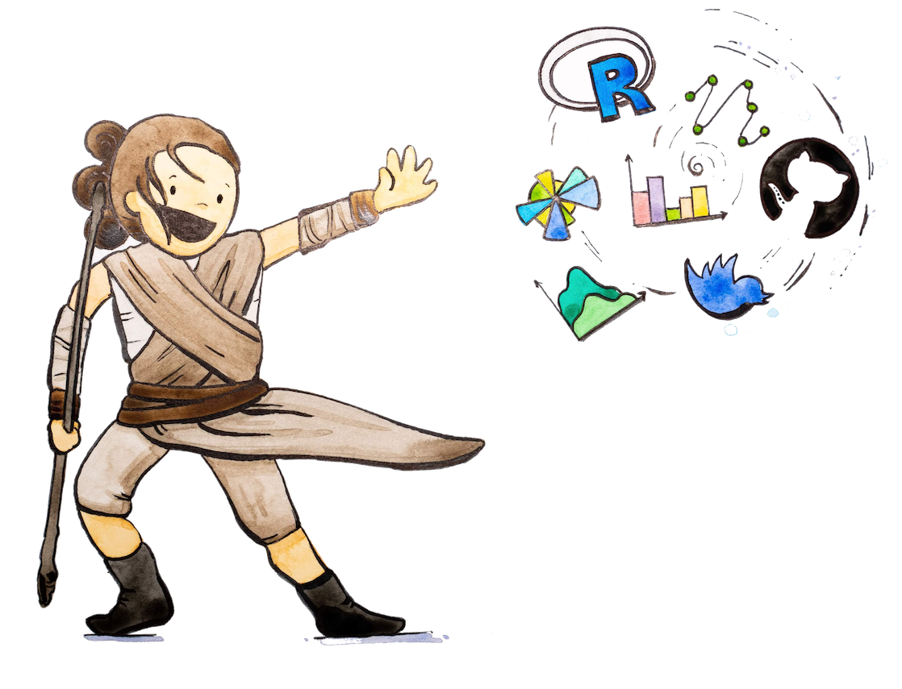

```{r setup, include=F}
library(librarian)
shelf(
  crayon, DiagrammeR, emo, extrafont, mitchelloharawild/icons, knitr, gadenbuie/xaringanExtra)
# icons::download_fontawesome() # run once
options(htmltools.dir.version = FALSE)

loadfonts(device = 'pdf', quiet = T)
fml <- 'Lato Light'

opts_chunk$set(
  message = F, echo = F, warning = F, 
  dev.args = list(family = fml), 
  dpi = 300, dev = 'png', fig.align = 'center', 
  out.width = '100%')
```

class: top, left

## May the Fourth be with You!

```{r, out.width = '60%'}

```
Credit: Artwork from @juliesquid for @openscapes (illustrated by @allison_horst).

???

- Presentation shortcuts:
  - `c`: clone synchronized window
  - `p`: presenter notes
- Star Wars figure:
  - Ok, so it's May 4th -- couldn't resist "Star Wars Day" reference
  - empower students with tools
  - work with community, be inclusive

---

## Course
### EDS 214: Analytical Workflows and Scientific Reproducibility

_2 units, offered in Summer_

The generation and analysis of environmental data is often a complex, multi-step process that may involves the <mark>collaboration</mark> of many people. Increasingly tools that document help to organize and document <mark>workflows</mark> are being used to ensure <mark>reproducibility</mark> and transparency of the results. This course will introduce students to conceptual organization of workflows as a way to conduct reproducible analyses, as well as various software tools that help users to manage multi-step processes that requires tools for storing, managing and <mark>sharing</mark> workflows, code, documents and data, including <mark>GitHub</mark>, Pegasus, remake and Kepler.

---

## Example
### Solar in Cali `r icon_style(fontawesome("sun", style = "solid"), fill = "orange")`

```{r example-setup, include=F}
knitr::opts_chunk$set(echo = T)

# load libraries ----
if (!require(librarian)){
  install.packages("librarian")
  library(librarian)
}
librarian::shelf(
  Matt-Brigida/EIAdata, dygraphs, 
  quiet = T)
```

```{r example-plot, fig.height=0.9, fig.width=1, echo=F}
# setup variables
api_key <- "5deaec228369f8806a73a6684f89cc74"
series  <- list(
  id    = "EBA.CAL-ALL.NG.SUN.H",
  name  = "Net generation from solar for California, hourly",
  units = "MWh")

# get data
x <- EIAdata::getEIA(series$id, api_key)
tzone(x) <- Sys.getenv("TZ")
y <- xts::last(x, "7 days")

# plot data
dygraphs::dygraph(y, ylab = series$units, main = series$name)
```

Source: [U.S. Energy Information Administration (EIA)](https://www.eia.gov/opendata/qb.php?category=3389873&sdid=EBA.CAL-ALL.NG.SUN.H).

???

- Within last week

---

## Example
### R Code `r icon_style(fontawesome("code", style = "solid"), fill = "grey")`

```{r example-code, echo=T, eval=F}
# setup variables
api_key <- "5deaec228369f8806a73a6684f89cc74"
series  <- list(
  id    = "EBA.CAL-ALL.NG.SUN.H",
  name  = "Net generation from solar for California, hourly",
  units = "MWh")

# get data
x <- EIAdata::getEIA(series$id, api_key)
tzone(x) <- Sys.getenv("TZ")
y <- xts::last(x, "7 days")

# plot data
dygraphs::dygraph(y, ylab = series$units, main = series$name)
```

---


## Motivation
### How to make this report '_**Evergreen**_'? `r icon_style(fontawesome("tree", style = "solid"), fill = "green")`

Normally on your personal computer (**PC**) `r fontawesome("laptop")`:

- Open RStudio

--

- Knit Rmarkdown file to html

--

- Git commit & push to Github, where website hosted

--

- Manually run, every month/week/day/hour ?! `r emo::ji("loudly_crying_face")`

--

```{r diagram-pc, echo=F}
DiagrammeR::grViz("
  digraph pc {
    graph [layout = dot, rankdir = LR]
  
    node [shape = box, fontname = Helvetica, fontsize=20, height = 2 width = 2]
    PC; Github
  
    node [shape = circle]
    git [label = 'git push']
  
    # several 'edge' statements
    PC->git->Github
  }", height = 100)
```

---

## Motivation
### How to make this report '_**Evergreen**_'? `r icon_style(fontawesome("tree", style = "solid"), fill = "green")`

Entrez **Github Actions** `r fontawesome("github")` (no PC needed)

```{r diagram-github, echo=F}
DiagrammeR::grViz("
  digraph github {
    graph [layout = dot, rankdir = LR]
  
    node [shape = box, fontname = Helvetica, fontsize=20, height = 2 width = 2]
    Github
  
    node [shape = circle, height = 1]
    git [label = 'Github Action']
  
    # several 'edge' statements
    Github->git->Github
  }", height = 100)
```

--
  
Use Github Action to render the Rmarkdown:

```r
usethis::use_github_action("render-rmarkdown")
```

--
  
```
✓ Setting active project to '/Users/bbest/github/bbest/gh-action-test-rmd'
✓ Creating '.github/'
✓ Adding '^\\.github$' to '.Rbuildignore'
✓ Adding '*.html' to '.github/.gitignore'
✓ Creating '.github/workflows/'
✓ Writing '.github/workflows/render-rmarkdown.yaml'
● Learn more at <https://github.com/r-lib/actions/blob/master/examples/README.md>
```

---

## Yet another Markup Language (YAML)

### Initial `render-rmarkdown.yaml`, `on.push`

`.github/workflows/`[`render-rmarkdown.yaml`](https://github.com/bbest/gh-action-test-rmd/blob/670e68f67ed2f768144702746b4b247b1144fb09/.github/workflows/render-rmarkdown.yaml) (commit:  `670e68f`)

```yaml
on:
  push:
    paths:
      - '**.Rmd' 
```      

Only updates when changes are sent with `git push`.

---

## Yet another Markup Language (YAML)

### Initial `render-rmarkdown.yaml`, `jobs.build`

`.github/workflows/`[`render-rmarkdown.yaml`](https://github.com/bbest/gh-action-test-rmd/blob/670e68f67ed2f768144702746b4b247b1144fb09/.github/workflows/render-rmarkdown.yaml) (commit:  `670e68f`)

```yaml
jobs:
  build:
    runs-on: macOS-latest
    env:
      GITHUB_PAT: ${{ secrets.GITHUB_TOKEN }}
    ...
```

Uses "secrets" already in Github to update the repository of code.

---

## Yet another Markup Language (YAML)

### Modify `render-rmarkdown.yaml`, `on.push|schedule`

`.github/workflows/`[`render-rmarkdown.yaml`](https://github.com/bbest/gh-action-test-rmd/blob/main/.github/workflows/render-rmarkdown.yaml) (commit: latest)


```yaml
on:
  push:                
  schedule:            
    - cron: '0 * * * *'
```  

--

- `push`: now without restriction for changes to `*.Rmd` files

--

- `schedule.cron`: See [Events that trigger workflows - GitHub Actions Docs](https://docs.github.com/en/actions/reference/events-that-trigger-workflows#schedule)

--

- **Question**: What's the cron syntax to run every Monday? Every 7th day?

---

## Yet another Markup Language (YAML)

### Modify `render-rmarkdown.yaml`, `on.workflow_dispatch`

`.github/workflows/`[`render-rmarkdown.yaml`](https://github.com/bbest/gh-action-test-rmd/blob/main/.github/workflows/render-rmarkdown.yaml) (commit: latest)


```yaml
on:
  push:
  schedule:
    - cron: '0 * * * *'
  workflow_dispatch:
```  

--

- `workflow_dispatch`: get [Actions button](https://github.com/bbest/gh-action-test-rmd/actions/workflows/render-rmarkdown.yaml) to run through Github web interface
  

---

## Github Actions Summary

With Github Actions, you can:

- Spin up a dedicated machine to crunch data and update your reports!

--

- For FREE!

--

- Within limits: ~ 1 hr with ~ 1 GB and small CPU


---

## More Actions...

- `usethis::`[`use_github_action()`](https://usethis.r-lib.org/reference/use_github_action.html)
  - [r-lib/actions: examples/](https://github.com/r-lib/actions/tree/master/examples#example-workflows)

--

RMarkdown workflows:

- [`render-rmarkdown`](https://github.com/r-lib/actions/tree/master/examples#render-rmarkdown) - Render one or more Rmarkdown files when they change and commit the result.
- [`bookdown`](https://github.com/r-lib/actions/tree/master/examples#build-bookdown-site) - Build a [bookdown] site and deploy it to [netlify].
- [`blogdown`](https://github.com/r-lib/actions/tree/master/examples#build-blogdown-site) - Build a [blogdown] site and deploy it to [netlify].

---

class: center, middle

# Thanks!

Example<br>
[github.com/bbest/gh-action-test-rmd](https://github.com/bbest/gh-action-test-rmd)<br> ([starlog](http://starlogs.net/#bbest/gh-action-test-rmd) `r emo::ji("sparkles")`)

.small[
Slides created via the R package [**xaringan**](https://github.com/yihui/xaringan) and [R Markdown](https://rmarkdown.rstudio.com).
]

[GitHub Pages]: https://pages.github.com/
[renv]: https://rstudio.github.io/renv/
[pkgdown]: https://pkgdown.r-lib.org/
[bookdown]: https://bookdown.org
[blogdown]: https://bookdown.org/yihui/blogdown/
[netlify]: https://www.netlify.com/
